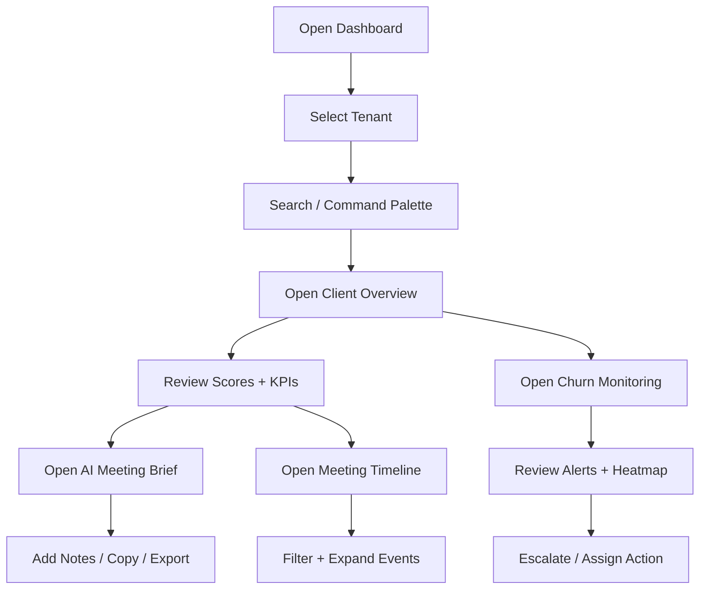

## 1. Product Overview
Monthly Touch Operating System is an AI-native client success dashboard that gives Account Managers and leadership a predictive, emotionally-aware view of client health, momentum, and churn risk.
It centralizes meeting intelligence, KPI performance, and proactive risk monitoring into a premium, operationally powerful workspace.

## 2. Core Features

### 2.1 User Roles
| Role | Authentication | Core Permissions |
|------|----------------|------------------|
| Account Manager | SSO / Email (Phase 2) | View assigned accounts, generate meeting briefs, edit notes, manage tasks and meeting artifacts |
| Leadership | SSO / Email (Phase 2) | View all accounts, churn monitoring, alert center, escalations, risk queue management |
| Analyst / Ops | SSO / Email (Phase 2) | KPI review, data QA, content and insight tagging, exports |

Phase 1 (frontend build) ships with mock data and local state only; auth and backend integration are designed but not implemented unless requested.

### 2.2 Feature Modules
1. **Client Overview**: strategic snapshot, KPI cards, health + risk scores, sentiment, AI insight banner, trend indicators.
2. **AI Meeting Brief**: executive summary, wins, challenges, recommended talking points, BI question, upsell opportunities, meeting mode, share/export.
3. **Meeting Timeline**: chronological activity feed with expandable events, search, filters, sentiment indicators, attachments and transcript placeholders.
4. **Churn Monitoring**: account risk heatmap, alert center, priority queues, sortable risk table, AI recommendations, escalation triggers.
5. **Global Command Center**: command palette, search, tenant switcher, notifications, keyboard shortcuts, theme toggle, breadcrumbs.

### 2.3 Page Details
| Page Name | Module Name | Feature Description |
|-----------|-------------|---------------------|
| Dashboard Shell | Sidebar + Topbar | Responsive sidebar, sticky top nav, breadcrumbs, global search, tenant switcher, notifications, theme toggle, command palette |
| Client Overview | Client Header | Logo, name, industry, assigned AM, sentiment badge, last/next meeting, compact KPI snapshot |
| Client Overview | Scores Row | Health score radial, churn risk score, engagement score, momentum score with trends and deltas |
| Client Overview | KPI Snapshot | KPI cards for GBP calls, rankings movement, reviews gained, leads generated, CPL, conversion rate |
| Client Overview | AI Insight Banner | AI-generated narrative, confidence, supporting signals, quick actions (copy/share) |
| AI Meeting Brief | Brief Panels | Executive summary, 3 wins, 2 challenges, talking points, BI question, upsell opportunities |
| AI Meeting Brief | Card Controls | Collapsible cards, confidence bars, severity badges, editable notes, copy/share/export |
| Meeting Timeline | Timeline Feed | Expandable events, categories, sentiment indicator, KPI delta preview, linked tasks |
| Meeting Timeline | Filters + Search | Category filter, date range, sentiment filter, free-text search |
| Churn Monitoring | Risk Heatmap | Visual grid of accounts by probability and severity, click-through to details |
| Churn Monitoring | Alert Center | AI alerts list with severity, recommended action, SLA countdown, escalation CTA |
| Churn Monitoring | Risk Table | Sortable TanStack table of accounts with metrics, badges, and next-best-action |

## 3. Core Process

### 3.1 Primary User Flows
- Account Manager opens a client record → gets instant overview → opens AI Meeting Brief → adds notes → exports/share brief → reviews timeline for context.
- Leadership opens Churn Monitoring → reviews risk queue and alerts → escalates accounts → assigns AM actions → tracks resolution status.
- Both roles use global search/command palette to jump between clients, sections, and alerts with keyboard shortcuts.

### 3.2 Flow Diagram

## 4. User Interface Design

### 4.1 Design Style
- Aesthetic: premium AI-native, minimal, enterprise-grade, emotionally-aware.
- Light/Dark: full theme support with consistent tokens and subtle elevation.
- Surfaces: soft borders, glass panels where appropriate, gentle shadows, high-contrast typography.
- Accent: a single “signal” accent for AI (e.g., cyan/teal) + status colors for risk/sentiment.
- Typography: crisp sans for body + distinctive display for section headings (loaded via next/font).
- Motion: restrained Framer Motion transitions, hover micro-interactions, skeleton shimmer, timeline expand/collapse.
- Icons: lucide-react only, consistent stroke weight.

### 4.2 Page Design Overview
| Page Name | Module Name | UI Elements |
|-----------|-------------|-------------|
| Dashboard Shell | Sidebar | Collapsible, responsive drawer on mobile, active state glow, grouped navigation, tenant switcher |
| Dashboard Shell | Topbar | Sticky, search, notifications, theme toggle, command palette shortcut hint |
| Client Overview | Score Widgets | Radial chart, numeric score, delta, small trend sparkline, contextual tooltips |
| Client Overview | AI Insight | Banner with gradient border, confidence bar, “signals detected” tags |
| AI Meeting Brief | Brief Cards | Collapsible sections, severity chips, editable note blocks, copy/export actions |
| Meeting Timeline | Event Cards | Category icon, sentiment dot, expandable details, attachments placeholders |
| Churn Monitoring | Risk Table | Badge-rich rows, sortable columns, row actions, empty and loading states |

### 4.3 Responsiveness
- Desktop-first, mobile-adaptive.
- Sidebar collapses into icon rail; on mobile becomes a sheet.
- Topbar stays sticky; critical scores remain above the fold.
- Tables become card-lists on small screens with key fields prioritized.
- Timeline supports touch-friendly expand/collapse and sticky filters.

### 4.4 Accessibility
- Keyboard navigable sidebar, command palette, table actions, and timeline expansion.
- High contrast in both themes; focus rings and ARIA labels on interactive controls.

