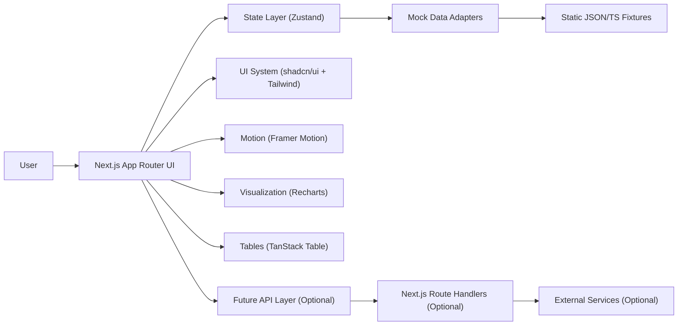

## 1. Architecture Design

## 2. Technology Description
- Framework: Next.js 15+ (App Router) + React + TypeScript
- Styling: TailwindCSS + CSS variables for theme tokens
- UI: shadcn/ui (Radix primitives) with customized tokens and premium surfaces
- State: Zustand stores for tenant, selected client, notifications, command palette, and UI preferences
- Charts: Recharts (radial + sparkline + small trend charts)
- Animations: Framer Motion for route and component transitions
- Icons: lucide-react
- Tables: TanStack Table for churn monitoring table with sorting, filtering, and row actions
- Data: mock dataset in TypeScript (Phase 1); designed for easy replacement with real APIs

## 3. Route Definitions (App Router)
| Route | Purpose |
|-------|---------|
| / | Redirect to default tenant dashboard/client |
| /dashboard | Shell landing page (overview + quick links) |
| /clients/[clientId]/overview | Client strategic snapshot |
| /clients/[clientId]/meeting-brief | AI meeting brief |
| /clients/[clientId]/timeline | Meeting timeline |
| /churn | Churn monitoring (risk heatmap + alert center + table) |
| /settings | Theme, keyboard shortcuts, preferences (Phase 1: UI only) |

## 4. Data Model (Frontend Domain Types)

### 4.1 Core Entities (TypeScript)
- Tenant: id, name, logo, planTier
- Client: id, tenantId, name, logoUrl, industry, assignedAM, sentiment, lastMeetingAt, nextMeetingAt
- ClientScores: healthScore, churnRiskScore, engagementScore, momentumScore, deltas, confidence
- KPISnapshot: gbpCalls, rankingsMovement, reviewsGained, leadsGenerated, cpl, conversionRate, period
- AIInsight: id, title, narrative, confidence, signals[], createdAt, severity
- MeetingBrief: id, clientId, executiveSummary, wins[], challenges[], talkingPoints[], biQuestion, upsellOps[], meetingMode, generatedAt
- TimelineEvent: id, clientId, type, timestamp, participants[], sentimentDelta, kpiDelta, aiSummary, actionItems[], attachments[]
- ChurnAlert: id, clientId, severity, probability, reason, recommendation, slaHours, createdAt, status

### 4.2 Event Categories
- Meeting, ActionItem, SentimentShift, KPIChange, Escalation, Commitment, Upsell, Risk

## 5. UI Architecture

### 5.1 Layout System
- Root layout: theme provider + fonts + global styles
- App shell layout: responsive sidebar + sticky topbar + main content + command palette portal
- Client layout: client header + section tabs + section content with animated transitions

### 5.2 Component Organization
- app/: Next.js routes and layouts
- components/shell/: Sidebar, Topbar, Breadcrumbs, TenantSwitcher, Notifications
- components/ai/: AIInsightCard, AIRecommendationPanel, StrategicNarrativeCard, AICopilotSidebar
- components/client/: HealthScoreWidget, SentimentBadge, KPIMetricCard, MeetingModeBadge
- components/meeting/: MeetingBriefCard, ExecutiveSummaryPanel
- components/timeline/: TimelineEventCard, TimelineFilters
- components/churn/: RiskAlertCard, RiskHeatmap, ChurnAlertTable
- components/common/: EmptyState, Skeletons, ErrorState, SectionHeader, CardFrame
- lib/: data adapters, formatters, constants, keyboard shortcuts
- stores/: zustand stores (tenant, ui, client, notifications)
- mock/: mock datasets and generators

## 6. State Management (Zustand)
- useTenantStore: activeTenantId, tenants[], switchTenant()
- useClientStore: selectedClientId, clientsById, setSelectedClient()
- useUIStore: sidebarCollapsed, theme, commandPaletteOpen, setTheme(), toggleSidebar()
- useNotificationStore: notifications[], markRead(), push()
- useChurnStore: alerts[], filters, selectedSeverity, sort, acknowledgeAlert()

State rules:
- Store only UI and selection state in Zustand.
- Keep derived data (computed scores, chart transforms) in selectors/util functions.
- Use optimistic UI patterns for local edits (notes, acknowledgements) with toast feedback.

## 7. Theming
- Tailwind uses CSS variables: --background, --foreground, --card, --border, --accent, --muted, --ring, etc.
- Theme toggle persists in localStorage (Phase 1).
- Dark theme is default; light theme mirrors contrast and elevation tokens.

## 8. Motion System
- Route transitions: subtle fade + slide (reduced motion respected)
- Card hover: micro-elevation + border glow
- Expand/collapse: height + opacity, spring easing
- Loading: skeleton shimmer and staggered content reveal

## 9. Error / Loading / Empty States
- Every page provides: skeleton loaders, empty states for missing data, and error boundary-friendly components.
- Table and timeline support: “no results” empty state when filters/search yield nothing.

## 10. Future Backend Integration (Optional)
If/when backend exists:
- Next.js Route Handlers under /app/api for secure server-side data access
- Replace mock adapters with fetchers (SWR/React Query optional; not required for Phase 1)
- Add auth (Supabase Auth or SSO provider) and tenant isolation rules

